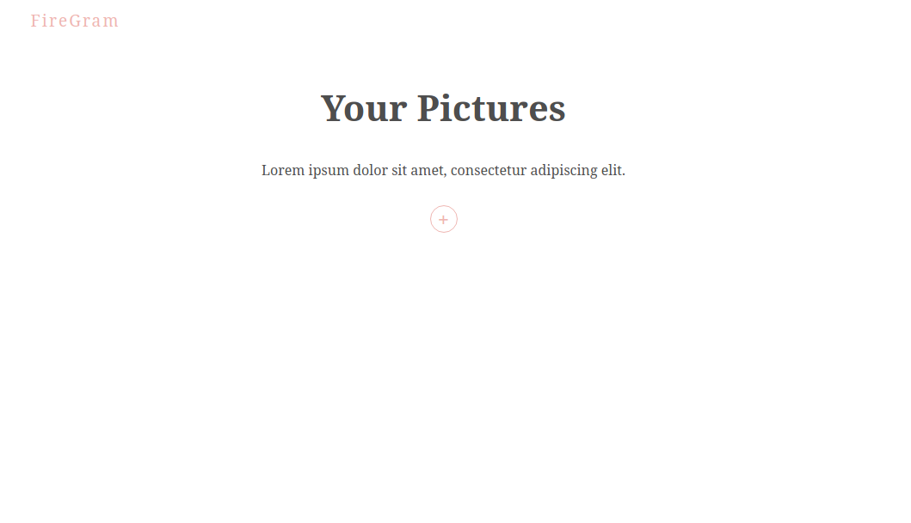
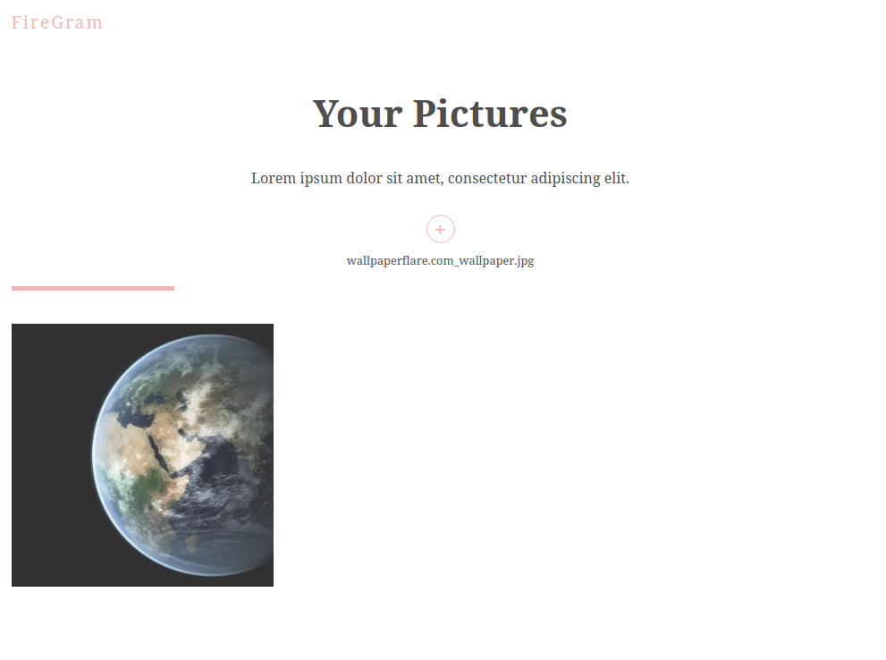
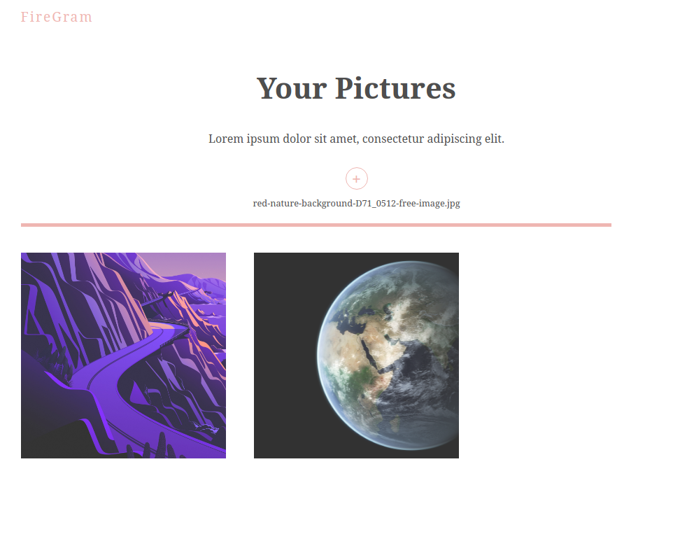
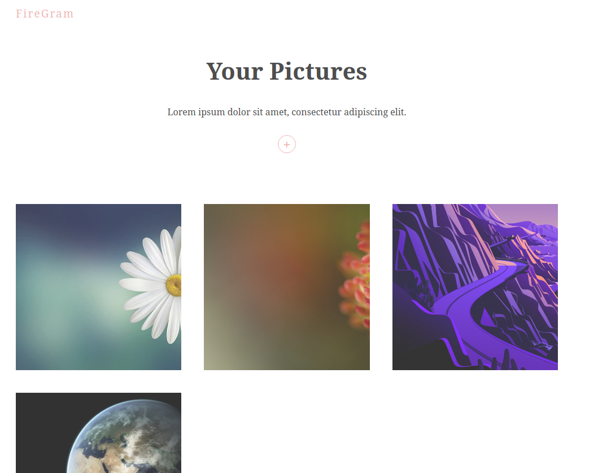
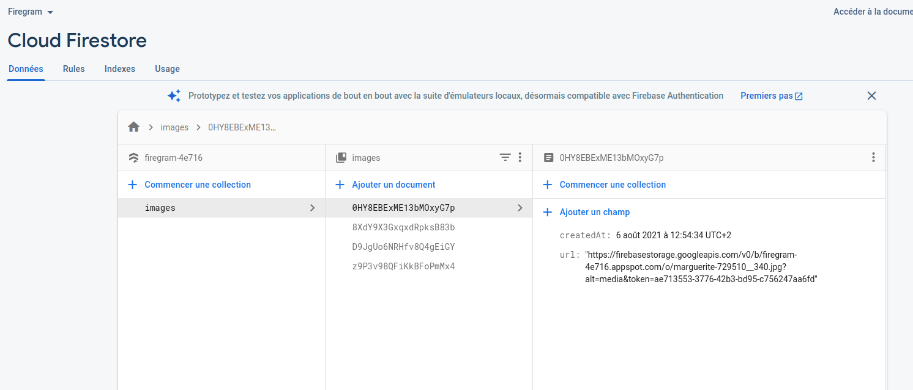
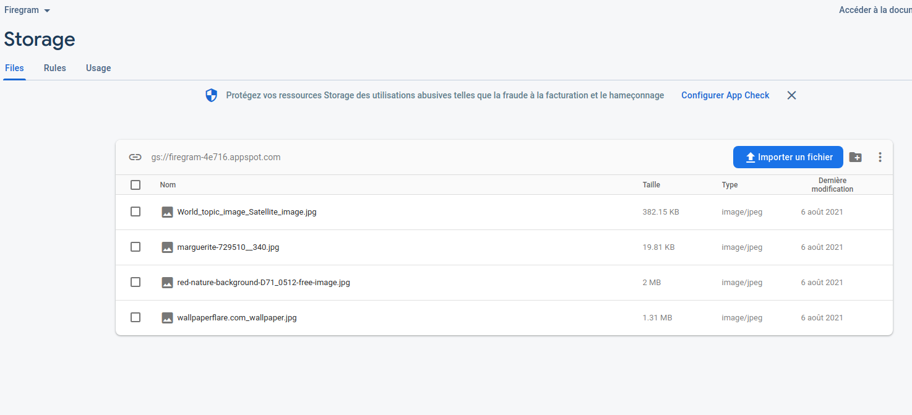

# Firegram

Firegram est une application de galerie photos de type Instagram utilisant :

- React
- Firebase
- Framer Motion

## Usage/Examples

Dans le cas où vous souhaitez utiliser ce projet, il suffit de le cloner et d'installer les dépendances.

Un fichier d'exemple de configuration est présent dans le dossier src/firebase

Les données sont à remplacer par vos informations (indiquées par exemple à la création du projet sur Firebase).

## Screenshots

